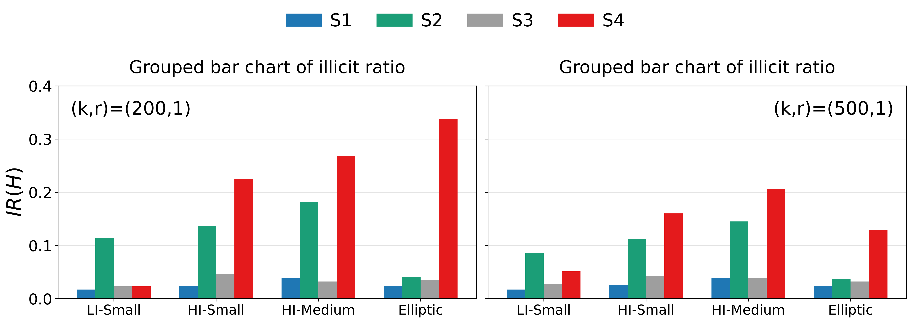
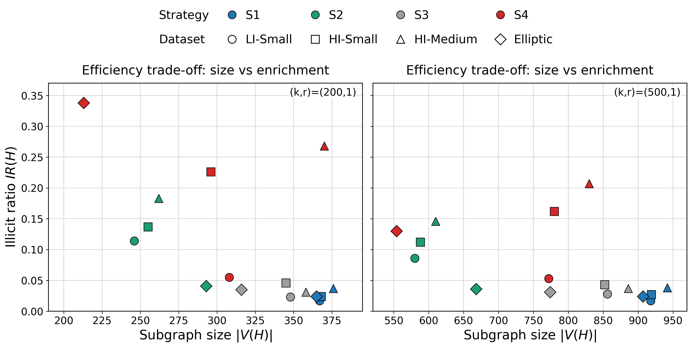
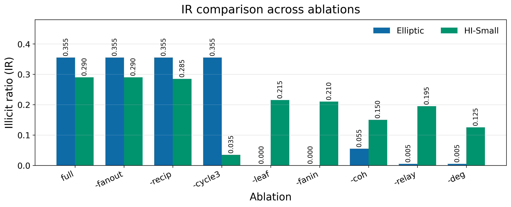
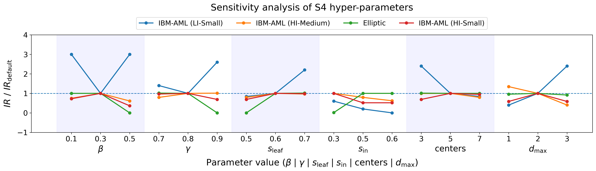

# Extracting Illicit‑Rich Subgraphs via Feed‑Guided Shortest Paths (SPNSA)

This repository contains the reference implementation for the research work:

**“Extracting Illicit‑Rich Subgraphs from Transaction Networks via Feed‑Guided Shortest Paths”**
(Doniyor Koshimbetov, Emine Şule Yazıcı, Asha Rao)

It studies **investigative subgraph extraction** for AML transaction graphs using the **Shortest Paths Network Search Algorithm (SPNSA)** and shows that the **choice of the feed set** can drastically change both the *size* and the *illicit enrichment* of the extracted subgraph.

The core contribution is a **label‑free, motif‑based coherent feed selection strategy (S4)** that targets nodes whose local directed neighborhoods resemble common laundering typologies (e.g., reciprocity/round‑tripping, relay behavior, star‑like aggregation/distribution), and then enforces *locality* via multi‑center selection.

---

## TL;DR (main empirical takeaways)

We evaluate 5 feed strategies (S0–S4) on **IBM‑AML** (HI‑Small, LI‑Small, HI‑Medium) and **Elliptic**:

- On **Elliptic**, at **(k,r)=(200,1)**, **S4** extracts a **213‑node** subgraph with **IR(H)=33.8%**, far above the dataset base rate (**2.23%**) and random feeds (~2–3%).
- On **IBM‑AML HI‑Small / HI‑Medium**, **S4** is best across tested settings, reaching illicit ratios in the **~16%–29%** range while staying in the few‑hundred‑node regime.
- On **IBM‑AML LI‑Small**, the best label‑free heuristic is **S2** (degree imbalance), not S4; at **(k,r)=(200,1)**, **S2** achieves **IR(H)=11.4%** vs **S4=5.5%**.






---

## Repository layout

```
.
├─ src/
│  ├─ spnsa.py                 # SPNSA extraction (ego‑nets + centrality + shortest paths)
│  ├─ feeds/
│  │  ├─ trivial.py             # S0–S3 baselines (oracle, random, degree‑diff, collect/distribute)
│  │  └─ motif.py               # motif scoring + coherent selection (S4)
│  ├─ data/
│  │  ├─ ibm_aml.py              # IBM‑AML CSV loaders + illicit node derivation
│  │  └─ elliptic.py             # Elliptic loaders (classes + edgelist)
│  ├─ graph/
│  │  └─ components.py           # largest weakly/strongly connected component utility
│  └─ run_motif_based.py         # S4 “run once” helper (single seed)
├─ scripts/
│  ├─ exp_LI_Small.py
│  ├─ exp_HI_Small.py
│  ├─ exp_HI_Medium.py
│  └─ exp_elliptic.py            # paper‑style evaluation runners
├─ data/                         # local datasets (gitignored)
└─ outputs/                      # local outputs (gitignored)
```

**Note on imports:** the experiment scripts prepend the repository root to `sys.path`, and import modules as `src.*`.

---

## Data setup (not included)

Create `data/` and place the raw dataset files as:

```
data/
  ibm-aml/
    LI-Small_Trans.csv
    HI-Small_Trans.csv
    HI-Medium_Trans.csv
  elliptic/
    elliptic_txs_classes.csv
    elliptic_txs_edgelist.csv
```

**IBM‑AML note:** the paper evaluates IBM‑AML on the **largest weakly connected component** (almost all illicit‑labeled nodes lie there).

IBM-AML dataset link: https://www.kaggle.com/datasets/ealtman2019/ibm-transactions-for-anti-money-laundering-aml

Elliptic dataset link: https://www.kaggle.com/datasets/ellipticco/elliptic-data-set

---

## Running experiments

Each script prints a small table with columns:
`strategy, k, r, |V|, |E|, |I|, IR`.

### Elliptic
```bash
python scripts/exp_elliptic.py
```

### IBM‑AML
```bash
python scripts/exp_LI_Small.py
python scripts/exp_HI_Small.py
python scripts/exp_HI_Medium.py
```

### Changing settings

In each `scripts/exp_*.py` file, edit:

- `(k,r)` (feed size and SPNSA radius)
- `S4_PARAMS` (candidate pool size `C`, coherence `centers` and `d_max`, motif weights, and neighborhood caps `max_in/max_out`)
- `S1_TRIALS` (number of random trials for S1; paper uses 100)

---

## Implementation notes

- **Label usage:** labels are *never* used to build S1–S4 feeds; S0 is an oracle upper bound used only for reference.
- **IBM illicit nodes:** evaluation derives *node* labels from *laundering edges* (an account is illicit if it appears as an endpoint of any laundering transaction).
- **Scalability controls:** S4 computes motif scores only on a candidate pool of size `C`, and optionally caps in/out neighborhoods (`max_in`, `max_out`) during scoring.

---

## Citation

If you use this code, please cite the accompanying paper.

---

## License

See `LICENSE`.
